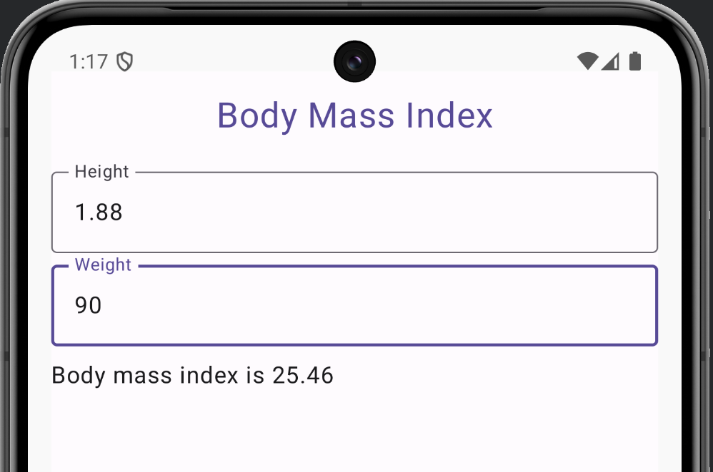

# Body mass index using ViewModel

Implement Android app with Kotlin and Compose, which calculates body mass index based on person’s height and weight.
In this exercise a ViewModel class should be used to hold all necessary information (member variables) and operations (methods).

## Implemented UI

